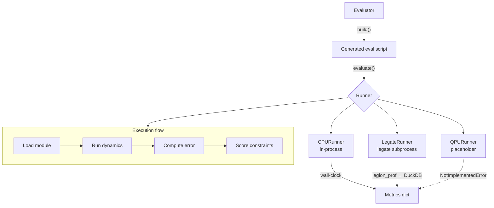

# `trovolut.filemaker`

OpenEvolve workflow generation and backend runners.

## Runner Architecture

```mermaid
flowchart TB
    EV[Evaluator] --> |"build()"| GEN[Generated eval script]
    GEN --> |"evaluate()"| R{Runner}
    R --> CR[CPURunner<br/>in-process]
    R --> LR[LegateRunner<br/>legate subprocess]
    R --> QR[QPURunner<br/>placeholder]

    CR --> |wall-clock| MET[Metrics dict]
    LR --> |"legion_prof → DuckDB"| MET
    QR -.-> |"NotImplementedError"| MET

    subgraph execution [Execution flow]
        direction LR
        LOAD[Load module] --> RUN[Run dynamics]
        RUN --> ERR[Compute error]
        ERR --> SCORE[Score constraints]
    end

    R --> execution
```

::: trovolut.filemaker
